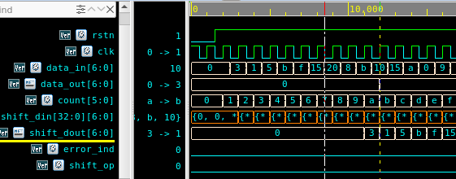
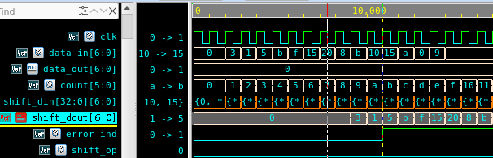

## shift_register.v

```verilog
`timescale 1ns/10ps

module shift_reg #(parameter WIDTH = 7)(
        input clk,
        input rstn,

        input signed [WIDTH-1:0] data_in,
        output reg signed [WIDTH-1:0] data_out
);

reg signed [WIDTH-1:0] shift_din [32:0];
integer i;
always@(posedge clk or negedge rstn) begin
        if(~rstn) begin
                for(i=32; i>=0; i=i-1) begin
                        shift_din[i] <= 0;
                end
        end
        else begin
                for(i=32; i>0; i=i-1) begin
                        shift_din[i] <= shift_din[i-1];
                end
                        shift_din[0] <= data_in;
                end
end

wire [WIDTH-1:0] shift_dout;
assign shift_dout = shift_din[8];

reg[5:0] count;
always@(posedge clk or negedge rstn) begin
        if(~rstn)begin
                count <= 4'b0;
        end
        else begin
                count <= count + 4'b1;
        end
end

reg[WIDTH-1:0] ref_data;
always@(posedge clk or negedge rstn) begin
        if(~rstn)begin
                ref_data <= 4'b0;
        end
        else if (count==6'd1)begin
                ref_data <= data_in;
        end
end

reg [WIDTH-1:0] data_out;
always@(posedge clk or negedge rstn) begin
        if(~rstn)begin
                data_out <= 4'b0;
        end
        else if (count==6'd10)begin
                data_out <= shift_dout;
        end
end


reg shift_op;
always@(posedge clk or negedge rstn) begin
        if(~rstn)begin
                shift_op <= 1'b0;
        end
        else if (count==6'd10)begin
                if(shift_dout == ref_data)
                        shift_op <= 1'b0;
                else
                        shift_op <= 1'b1;
        end
end

reg error_ind;
always@(posedge clk or negedge rstn)begin
        if(~rstn)begin
                error_ind <= 1'b0;
        end
        else if (count==6'd10) begin
                if(shift_dout ==3)
                        error_ind <= 1'b0;
                else
                        error_ind <= 1'b1;
        end
end
endmodule
```

### 코드 설명 :
- data_in -> (shift_din / shift_dout) : 33칸 짜리 f/f -> data_out
- clk 마다 count해서 count =10 에서 data_out <= shift_dout

----------

## simulation img
### 1. #25
<br>
- tb 에서 #25을 주어 negedge clk에 data_in이 들어가면, 그 다음 posedge clk에서 shift_din이 업데이트 하게 되고 count 10 일때 shift_dout은 3이다.

### 1. #20
<br>
- tb 에서 #20을 주어 posedge clk에 정확히 data_in이 들어가면 즉시 shift_din이 업데이트 되어 #25와 비교했을 때 shift_din이 한칸씩 왼쪽으로(빠르게) 밀리게 되었다.
  따라서 count 10일때 shift_dout은 1이다.

--------

## setup time, hold time
### 타이밍 에러
- gate level 에서 타이밍 에러 원인을 찾는다
### setup time
- setup violation 발생 : 
  - setup time을 지키지 못한 것
  - propagation delay 를 줄일 수 있으면 best
    - 50Mhz clk을 사용한다면 이 clk은 20ns 이다
    - if) setup time < propagation delay time => 문제 발생
    - 해결 방안 : 파이프라인을 박아 넣어 (F/F으로 만들어) propagation delay를 줄이자

### hold time
- hold violation 발생 :
  - hold time을 지키지 못한 것
  - delay를 줘야한다
    - 해결 방안 : 버퍼 추가

------------------------

# Verilog & SystemVerilog 정리

## Verilog

### `initial` vs `always`

| 항목        | `initial`                                 | `always`                                   |
|-------------|--------------------------------------------|---------------------------------------------|
| 실행 시점   | 시뮬레이션 시작 시 1회만 실행             | 조건(감지 리스트) 발생 시마다 반복 실행     |
| 용도        | 초기화, 테스트벤치                        | 동작 로직 (조합/순차 회로 설계)            |
| 사용 위치   | 주로 테스트벤치                           | 주로 회로 설계 본문                        |

---

### 조합논리 vs 순차논리

| 구분         | 조합 논리 (Combinational)        | 순차 논리 (Sequential)              |
|--------------|----------------------------------|-------------------------------------|
| 상태 저장    | 없음                             | 있음 (레지스터, 플립플롭 사용)     |
| 트리거       | 입력 변화                         | 클럭, 리셋 등 트리거 필요           |
| 예시         | `assign`, `always @(*)`          | `always @(posedge clk)`             |

---

### Blocking (`=`) vs Non-Blocking (`<=`)

| 항목            | Blocking (`=`)            | Non-Blocking (`<=`)                |
|------------------|----------------------------|-------------------------------------|
| 실행 방식        | 순차적 (line-by-line)       | 병렬적 (동시 업데이트 예약)         |
| 용도             | 조합논리 (testbench 등)     | 순차논리 (레지스터 업데이트)       |
| 사용 시 주의     | 값 덮어쓰기 가능성 있음     | 순차 회로 구현 시 안정적 동작       |

---

### Latch vs Flip-Flop

| 항목        | Latch                            | Flip-Flop                          |
|-------------|-----------------------------------|-------------------------------------|
| 트리거 방식 | 레벨 트리거 (level-sensitive)    | 에지 트리거 (edge-sensitive)       |
| 민감도      | enable이 1일 때 입력 따라감       | 클럭의 상승/하강 에지에서만 작동   |
| 용도        | 낮은 지연 회로, 비동기 설계 등   | 안정적인 동기 회로 설계            |
| 생성 예     | `always @(enable or d)`          | `always @(posedge clk)`            |

---

## SystemVerilog

### 2-State vs 4-State 변수

| 타입 구분    | 설명                                               |
|--------------|----------------------------------------------------|
| **2-state**  | `bit`, `byte`, `shortint`, `int`, `longint`, `real` 등<br>값: `0`, `1` |
| **4-state**  | `logic` (Verilog의 `reg` + `wire` 통합)<br>값: `0`, `1`, `x`, `z`     |
| 사용 권장    | 회로 합성 시 `2-state` 사용 권장, 시뮬용 `4-state`도 지원됨 |

---

### `task` vs `function`

| 항목         | `task`                                   | `function`                                 |
|--------------|--------------------------------------------|---------------------------------------------|
| 반환값       | 없음 (`void`)                              | 1개의 반환값                                |
| 실행 방식    | blocking (순차적 실행)                      | non-blocking (즉시 반환)                   |
| 시간 제어    | 가능 (`#`, `@` 사용 가능)                  | 불가능 (`#`, `@` 사용 불가)                |
| 사용 목적    | 복잡한 동작, 시간 지연 포함 로직            | 간단한 계산, 즉시 반환 함수                |

---

## Gate-Level Simulation

| 옵션         | 설명 |
|--------------|------|
| `-v <file>`  | 개별 라이브러리 파일 직접 포함 (e.g., stdcells.v) |
| `-y <dir>`   | 라이브러리 파일이 존재하는 디렉토리 전체 포함     |

```bash
vcs -v cells.v -y ./lib/ my_design.v
```

---

## Hazard & Glitch

| 개념         | 설명 |
|--------------|------|
| **Hazard**   | 입력 변화로 인해 출력에 의도치 않은 단기적 오류 발생<br>- Static Hazard<br>- Dynamic Hazard |
| **Glitch**   | 짧은 시간 동안 잘못된 출력 발생 (논리게이트 지연, race condition 등으로 발생) |

해결법: 회로 리타이밍, 부울 최소화, 클럭 정렬 등