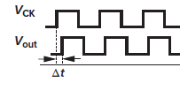
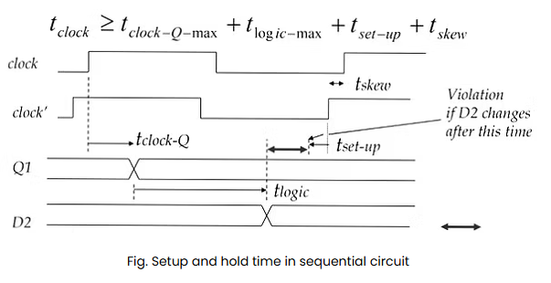

## clk skew
 
- $\Delta t$ 만큼 clk skew : gate를 지나며 RC delay
----------------

## clk $t$ >= 전체 경로 지연(setup time ...)
### setup timing 계산 시:
$Trequired = Tclk - Tuncertainty - Tsetup$   
    
- 클럭 주기는 데이터가 다음 FF에 도달할 수 있는 시간 여유
- 이 안에: `출력 `&rarr;`조합논리`&rarr;`입력`&rarr;`setpu 충족` 모두 끝나야 한다.
- 클럭 주기가 짧아서 setup time을 만족하지 못하면 &rarr; 데이터 못잡고 &rarr; 타이밍 오류 발생

--------

## 1. 기본 합성 흐름
- **Basic Synthesis Flow**: RTL → Logic Synthesis → Netlist

## 2. Timing 관련 용어
- **Setup Time**
  - 데이터가 클럭 엣지 전에 안정화되어야 하는 최소 시간
- **Hold Time**
  - 클럭 엣지 이후에도 데이터가 안정적으로 유지되어야 하는 최소 시간
- **Recovery/Removal Time**
  - 비동기 reset의 timing 기준
- **Clock Skew**
  - 동일한 클럭이 도달하는 시점의 차이
- **Critical Path**
  - 가장 큰 지연을 갖는 경로, Setup violation에 영향

## 3. Timing Constraint 명령어
- `create_clock`
  - `create_clock “CLK1” –period 10 –waveform {0 5.0}`
  - 100 MHz 클럭, 0~5ns 구간이 high

- `set_clock_uncertainty`
  - `–setup 0.65`: setup 분석 시 margin 확보
  - `–hold 0.45`: hold 분석 시 margin 확보

- `set_clock_transition`
  - 클럭의 fall time 설정: `set_clock_transition 0.64 –fall [...]`

- `set_max_transition`
  - 최대 신호 전이 시간 설정: `0.3 ns`

- `set_max_fanout`
  - fanout 수 설정 (예: 64)

- `set_input_delay`
  - 입력 신호의 최대 지연 시간: `1.35 ns`

- `set_output_delay`
  - 출력 신호의 최대 지연 시간: `1.0 ns`

- `set_multicycle_path`
  - 데이터 경로에 대해 여러 클럭 주기 허용: `2 cycle`

- `set_false_path`
  - 타이밍 분석에서 제외할 경로 지정

## counter1_0.timing_max.rpt
### 데이터 도착 경로
- **count_reg_0_/Q** : FF내부에서 clk to Q 지연 시간 (62.79ps)
- **U14/Z** : 첫 번째 조합 게이트 지연 (15.88ps)
- **U13/Z** : 두 번째 조합 게이트 지연 (7.13ps)
- **U18/Z** : 마지막 조합 게이트 지연 (30.05ps)
- **count_reg_2/D** : 도착점 FF 입력 (0ps)
  - ****총 도착 시간** = 115.86ps
### 데이터 요구 경로
- **clock cnt_clk (rise)** : 다음 클럭 엣지 시점 (700ps)
- **uncertainty** : 클럭 지터, 스큐 등을 고려한 보정 ( -50ps)
- **setup time** : 도착점 FF의 setup time (-54.03ps)
  - 요구 시간 = 595.97ps
### Slack 계산
- $Slack = Required time - Arrival time = 595.97 - 115.86 = 480.12ps$
- Slack > 0 &rarr; 타이밍 여유 충분 : 타이밍 만족 (MET)
-----------------------
### setup timing 계산 시:
$Trequired = Tclk - Tuncertainty - Tsetup$
------------------------------------
### 설정 파일
**.sdc** : 타이밍 제약 파일   
**.tcl** : 합성/STA(static timing analysis)스크립트 파일   
**.dc** : Design Compiler에서 사용하는 디자인 파일

## ASIC 설계 검증 
[0] **MobaXterm** 설정   
 ↓   
[1] **RTL 설계** (SystemVerilog) :    
    모듈, tb.v + .tcl , .sdc   
 ↓   
[2] **RTL Simulation** (논리 시뮬레이션, VCS)    
    compile : vcs   
    run : ./simv      
 ↓   
[3] **Synthesis** (DC-Design Compiler, .sdc/.tcl    기반)   
    .tcl 물려서 dc_shell 로 합성 : .dc 실행   
 ↓   
[4] **Gate-level Netlist** 생성   
    output/ 에 생긴 .v 가 gate-level netlist   
 ↓   
[5] **Gate-level Simulation** (post-synthesis)   
 ↓   
[6] **STA** (PrimeTime로 타이밍 분석 → setup/hold 확인)    