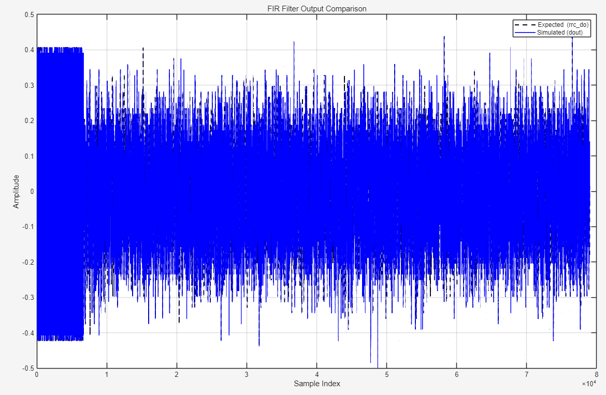
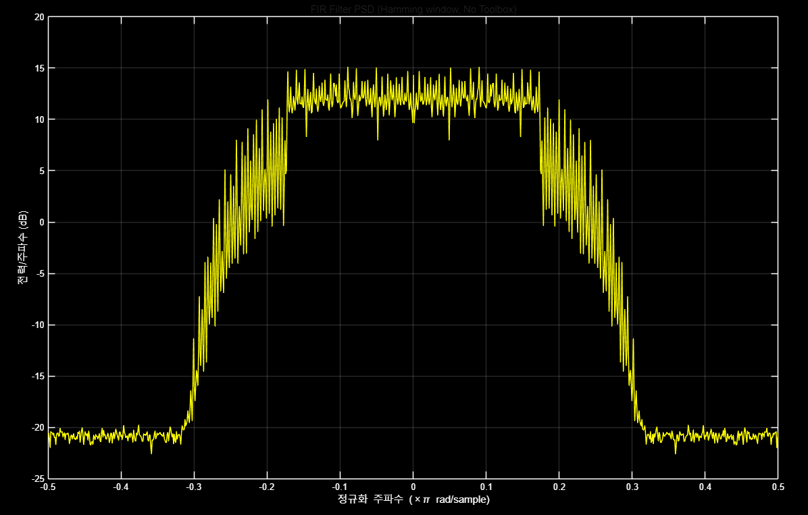
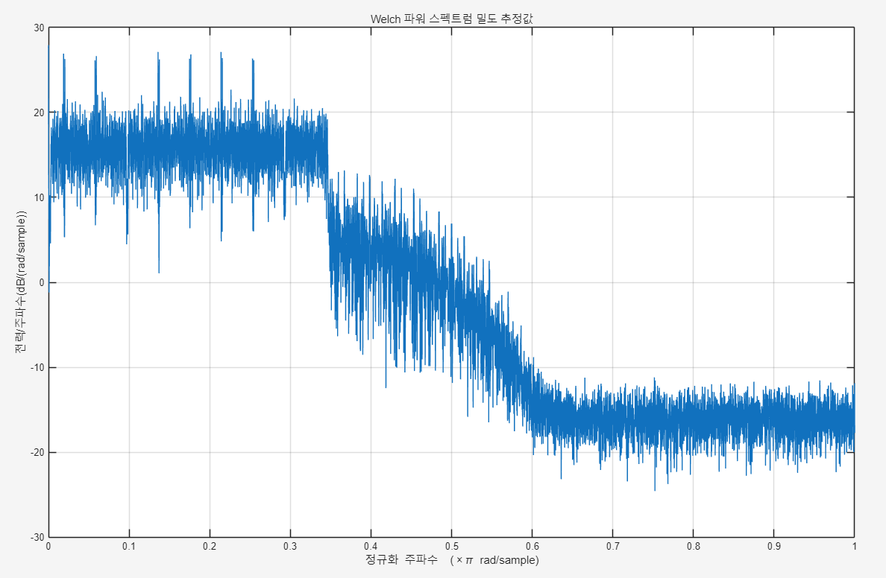
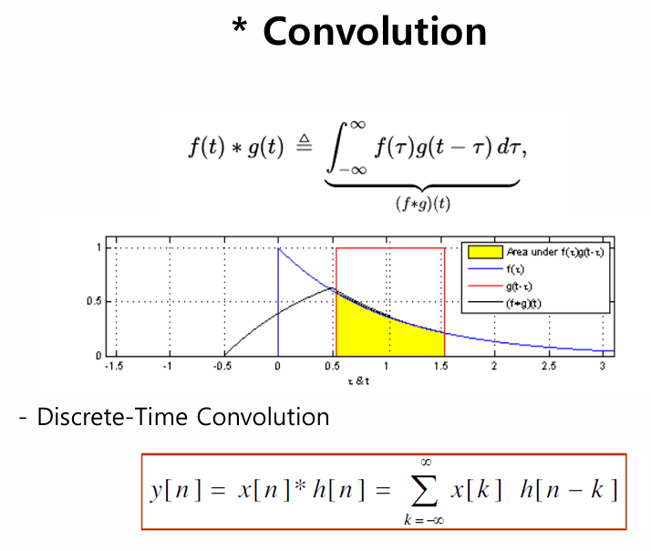
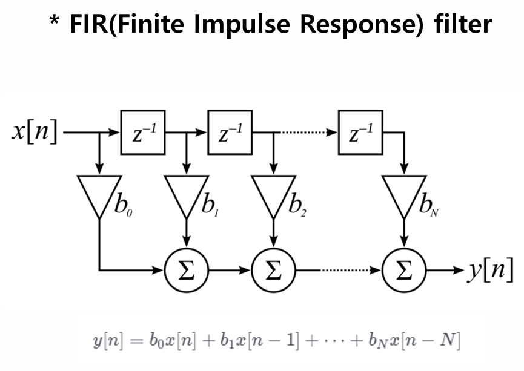
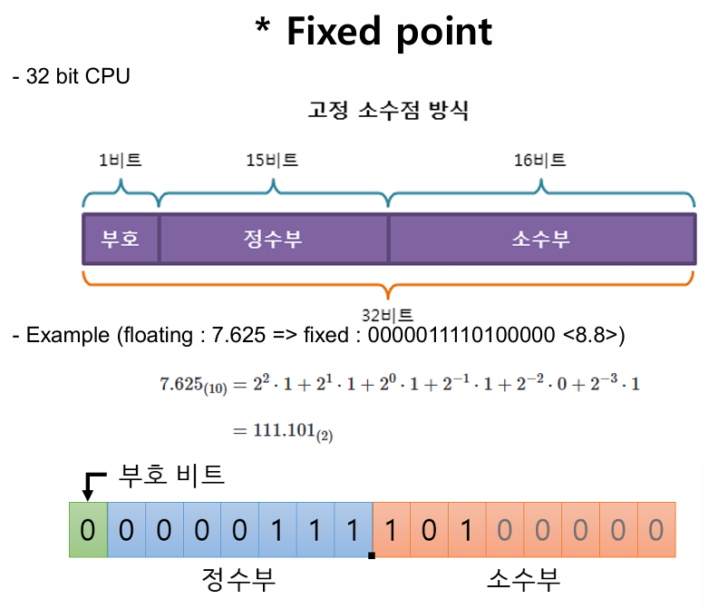
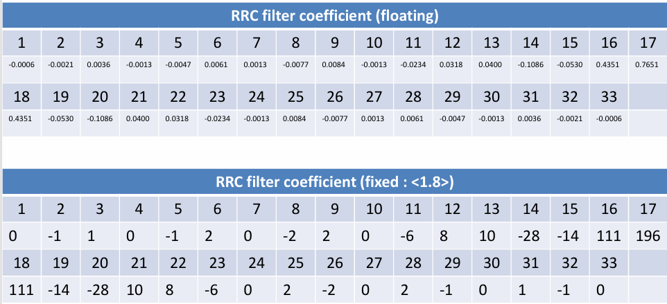
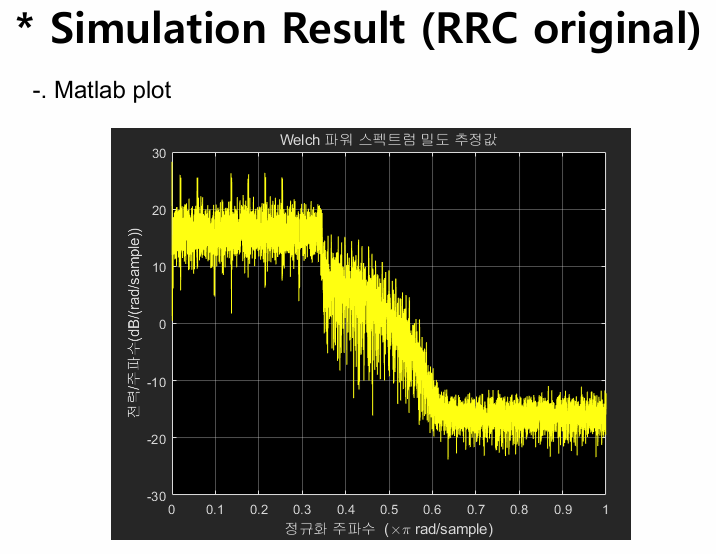

# Filter

## fir_filter.sv
### acc += mult; &rarr; 직렬방식 : delay 증가
```SystemVerilog
`timescale 1ns/1ps

module fir_filter (
    input  logic clk,
    input  logic rst_n,
    input  logic signed [6:0] din,         // Q1.6 입력
    output logic signed [6:0] dout         // Q1.6 출력
);

    parameter TAP = 33;

    // Q1.8 fixed-point RRC coefficients (signed 9-bit)
    localparam signed [8:0] COEFF [0:TAP-1] = '{
         0,  -1,   1,   0,  -1,   2,   0,  -2,   2,   0,
        -6,   8,  10, -28, -14, 111, 196, 111, -14, -28,
        10,   8,  -6,   0,   2,  -2,   0,   2,  -1,   0,
         1,  -1,   0
    };

    // Shift register for input samples (Q1.6)
    logic signed [6:0] shift_reg [0:TAP-1];

    // Accumulator: 7b * 9b = 16b → sum → 32b 정수
    logic signed [31:0] acc;

    // Intermediate output before final FF
    logic signed [6:0] dout_next;

    // Shift register: 입력 샘플 이동
    always_ff @(posedge clk or negedge rst_n) begin
        if (!rst_n) begin
            for (int i = 0; i < TAP; i++) shift_reg[i] <= 0;
        end else begin
            shift_reg[0] <= din;
            for (int i = 1; i < TAP; i++)
                shift_reg[i] <= shift_reg[i - 1];
        end
    end

    // FIR 연산 (multiply-accumulate) — Q1.6 × Q1.8 = Q2.14 누적
    always_comb begin
        acc = 0;
        for (int i = 0; i < TAP; i++) begin
            logic signed [15:0] mult;
            mult = $signed(shift_reg[i]) * $signed(COEFF[i]);  // Q1.6 * Q1.8 = Q2.14
            acc += mult;   //delay 심한 방식 -> 병렬로 수정 필요
        end
    end

    // 라운딩 및 클리핑: Q2.14 → Q1.6
    always_ff @(posedge clk or negedge rst_n) begin
        if (!rst_n) begin
            dout_next <= 0;
        end else begin
            logic signed [15:0] rounded;
            rounded = acc >>> 8;  // +0.5 (128) for rounding → shift 8 → Q1.6

            // Saturation (Clip to [-64, +63])
            if (rounded > 63)
                dout_next <= 63;
            else if (rounded < -64)
                dout_next <= -64;
            else
                dout_next <= rounded[6:0];
        end
    end

    // 최종 출력 FF (타이밍 안정용)
    always_ff @(posedge clk or negedge rst_n) begin
        if (!rst_n)
            dout <= 0;
        else
            dout <= dout_next;
    end
endmodule
```

## fir_filter.sv 
### array 사용 : 병렬 방식으로 delay 감소

## tb_fir_filter.sv
```SystemVerilog
`timescale 1ns/1ps

module tb_fir_filter;

    logic clk, rst_n;
    logic signed [6:0] din;
    logic signed [6:0] dout;

    fir_filter dut (
        .clk(clk),
        .rst_n(rst_n),
        .din(din),
        .dout(dout)
    );

    // Clock
    initial clk = 0;
    always #5 clk = ~clk;

    // File handles
    integer fd_in, fd_out, r;
    int cycle = 0;
    int max_print = 46500;  // 전체의 절반 정도만 화면에 출력

    initial begin
        $dumpfile("tb_fir_filter.vcd");
        $dumpvars(0, tb_fir_filter);

        rst_n = 0;
        din = 0;
        #20 rst_n = 1;

        fd_in = $fopen("input_vector.txt", "r");
        fd_out = $fopen("output_vector.txt", "w");

        if (fd_in == 0 || fd_out == 0) begin
            $display("❌ 파일 열기 실패!");
            $finish;
        end

        while (!$feof(fd_in)) begin
            r = $fscanf(fd_in, "%d\n", din);
            #10;
            $fwrite(fd_out, "%0d\n", dout);
            if (cycle < max_print)
                $display("[%0t ns] din = %0d, dout = %0d", $time, din, dout);
            cycle++;
        end

        $fclose(fd_in);
        $fclose(fd_out);
        $display("✅ 총 %0d개의 벡터 처리 완료", cycle);
        $display("📂 output_vector.txt 파일에서 전체 출력 결과 확인 가능");
        #100;
        $finish;
    end

endmodule

```
-----------------
### filter 결과 - MATLAB(wave1)   
<br>
- 고주파는 막고, 저주파는 통과시키는 필터
- 예상값과 실제 나온 값 비교

-----------
### filter 결과 - wave2
<br>
- 중심 축 0, 사이드 제한 0.5 (샘플링 두배)
--------------
### filter 결과 - wave3
<br>
- 2번 wave (위의 wave)와 같음

-------------------------------------------
다음은 `Project_1_stu.pdf`의 내용을 **요약한 Markdown 형식**입니다:

---

## Project #1 요약

### 목표
- 원치 않는 주파수 성분(노이즈)을 제거하기 위한 **필터 회로** 설계
- 주요 목적: 특정 주파수 차단 또는 통과

---

### 1. Filter 개요
- **응용 분야**: 전자/전기 회로, 음성/영상 처리, 통신 시스템
- **저역통과필터 (LPF)**:
  - 저주파 통과 / 고주파 차단
  - A/D 변환기에서 필수 사용됨

---

### 2. Convolution
- 이산-시간 컨볼루션 (Discrete-Time Convolution)
- FIR 필터 구현에 사용됨   
<br>   


---

### 3. FIR 필터
- **FIR (Finite Impulse Response)**: 유한 길이의 임펄스 응답
- LPF 설계에 적합   
- <br>

---

### 4. RRC 필터 (Root Raised Cosine)
- **정수계수 (Fixed point, <1.8>)**
- **부동소수점계수 (Floating point)**   
<br>   

예: floating : 7.625 → fixed : 0000011110100000 (<8.8> 포맷)   

<br>   
---

### 5. 시뮬레이션
- **Matlab 결과 플롯**    
<br>   
---

### 6. Matlab 환경
- 제공: Mathworks
- 스크립트 기반(m-file), 행렬 연산 최적화
- 사용 쉬움, 컴파일 관대, C/C++보다 느림
