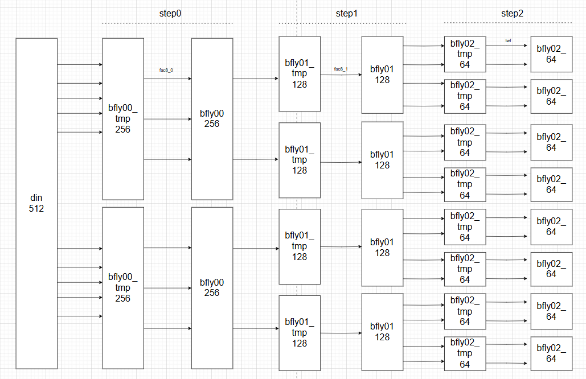

# Filter 구현 및 테스트
## 과정
1. 모델 구현
2. rtl simulation
3. 합성
4. gate level simulation

## 설계
1. rrc_filter를 설계하여 rtl simul을 확인
2. run_rrc_filter.dc 를 통해 **합성**
   - .tcl, .sdc, _filelist, script(디렉토리) 필요
3. gate level simulation
   - xpro_rrc_filter_filelist : Netlist랑 tb 물림
   - rrc_filter__0.v : 합성 결과로 만들어진 Netlist 가져오고
   - run_xpro_rrc_filter : filelist 물리고 gate level simul 명령어 실행

## 과정
1. 합성 후 타이밍 체크 &rarr; 타이밍 에러 발생
2. 각 convolusion 과정에 f/f (파이프 레지스터) 쳐주기
3. 다시 simul(verdi), gate level simul을 통해 체크 

----

# .m 
## cos_ in_gen.m
```MATLAB
% Added on 2024/01/12 by jihan 
function [data_float, data_fixed] = cos_in_gen(fft_mode, num)
 N = num;

 for i=1:N
	data_float_re(i) = cos(2.0*pi*(i-1)/N);   % cosine 생성
	data_float_im(i) = 0.0;    % 순수 실수만 입력, 허수부 0
	data_float(i) = data_float_re(i) + j*data_float_im(i);   %복소수 형태
 end

 for i=1:N
  if (data_float_re(i)==1.0)  % 최대값 1.0은 곱셈 없이 직접 상수로 할당
   if (fft_mode==1) % FFT 모드라면
	%data_fixed_re(i) = 127; % <2.7>
	data_fixed_re(i) = 63; % <3.6> % Modified on 2025/07/02 by jihan
   else % IFFT, 9비트 중 부호1, 정수2(-4~+3), 소수6 -> 정수 최대값 : 63
	data_fixed_re(i) = 255; % <1.8>
	%data_fixed_re(i) = 127; % <2.7> % Modified on 2025/07/02 by jihan
   end
  else	
   if (fft_mode==1) % FFT
	%data_fixed_re(i) = round(data_float_re(i)*128); % <2.7>
	data_fixed_re(i) = round(data_float_re(i)*64); % <3.6> % Modified on 2025/07/02 by jihan
   else % IFFT
	data_fixed_re(i) = round(data_float_re(i)*256); % <1.8>
	%data_fixed_re(i) = round(data_float_re(i)*128); % <2.7> % Modified on 2025/07/02 by jihan
   end
  end

  if (data_float_im(i)==1.0)  % 1.0은 실수 표현
   if (fft_mode==1) % FFT
	%data_fixed_im(i) = 127; % <2.7>
	data_fixed_im(i) = 63; % <3.6> % Modified on 2025/07/02 by jihan
   else % IFFT
	data_fixed_im(i) = 255; % <1.8>
	%data_fixed_im(i) = 127; % <2.7> % Modified on 2025/07/02 by jihan
   end
  else	
   if (fft_mode==1) % FFT
	%data_fixed_im(i) = round(data_float_im(i)*128); % <2.7>
	data_fixed_im(i) = round(data_float_im(i)*64); % <3.6> % Modified on 2025/07/02 by jihan
   else % IFFT
	data_fixed_im(i) = round(data_float_im(i)*256); % <1.8>
	%data_fixed_im(i) = 127; % <2.7> % Modified on 2025/07/02 by jihan
   end
  end

	data_fixed(i) = data_fixed_re(i) + j*data_fixed_im(i);
 end
end
```
## fft_float.m
```MATLAB
% Added on 2025/07/01 by jihan 
function [fft_out, module2_out] = fft_float(fft_mode, fft_in)  % module2_out : buttefly 출력

% 초기 설정
 shift = 0;
 SIM_FIX = 0; % 0: float, 1: fixed

% IFFT = FFT 결과를 복소켤레(conj)로 만들어 평균
 if (fft_mode==1) % fft
	din = fft_in;
 else % ifft
	din = conj(fft_in);
 end

% twiddle factor 계수
 fac8_0 = [1, 1, 1, -j];
 fac8_1 = [1, 1, 1, -j, 1, 0.7071-0.7071j, 1, -0.7071-0.7071j];

 %-----------------------------------------------------------------------------
 % Module 0
 %-----------------------------------------------------------------------------
 % step0_0
 bfly00_out0 = din(1:256) + din(257:512);    
 bfly00_out1 = din(1:256) - din(257:512);

 bfly00_tmp = [bfly00_out0, bfly00_out1];    % step0_0의 butterfly 연산, 입력을 반으로 나누고 -> 더하고 빼서 완성

 for nn=1:512
	bfly00(nn) = bfly00_tmp(nn)*fac8_0(ceil(nn/128));
 end

 % step0_1
 for kk=1:2
  for nn=1:128
	bfly01_tmp((kk-1)*256+nn) = bfly00((kk-1)*256+nn) + bfly00((kk-1)*256+128+nn);
	bfly01_tmp((kk-1)*256+128+nn) = bfly00((kk-1)*256+nn) - bfly00((kk-1)*256+128+nn);
  end
 end


 for nn=1:512
	bfly01(nn) = bfly01_tmp(nn)*fac8_1(ceil(nn/64));
 end

 % step0_2
 for kk=1:4
  for nn=1:64
	bfly02_tmp((kk-1)*128+nn) = bfly01((kk-1)*128+nn) + bfly01((kk-1)*128+64+nn);
	bfly02_tmp((kk-1)*128+64+nn) = bfly01((kk-1)*128+nn) - bfly01((kk-1)*128+64+nn);
  end
 end

 % Data rearrangement
 K3 = [0, 4, 2, 6, 1, 5, 3, 7];  % bit-reversal 인덱스

 for kk=1:8
  for nn=1:64
	twf_m0((kk-1)*64+nn) = exp(-j*2*pi*(nn-1)*(K3(kk))/512);
  end
 end  % Twiddle factor 생성

 for nn=1:512
	bfly02(nn) = bfly02_tmp(nn)*twf_m0(nn);
 end

 %-----------------------------------------------------------------------------
 % Module 1
 %-----------------------------------------------------------------------------
 % step1_0
 for kk=1:8
  for nn=1:32
	bfly10_tmp((kk-1)*64+nn) = bfly02((kk-1)*64+nn) + bfly02((kk-1)*64+32+nn);
	bfly10_tmp((kk-1)*64+32+nn) = bfly02((kk-1)*64+nn) - bfly02((kk-1)*64+32+nn);
  end
 end

 for kk=1:8
  for nn=1:64
	bfly10((kk-1)*64+nn) = bfly10_tmp((kk-1)*64+nn)*fac8_0(ceil(nn/16));
  end
 end

 % step1_1
 for kk=1:16
  for nn=1:16
	bfly11_tmp((kk-1)*32+nn) = bfly10((kk-1)*32+nn) + bfly10((kk-1)*32+16+nn);
	bfly11_tmp((kk-1)*32+16+nn) = bfly10((kk-1)*32+nn) - bfly10((kk-1)*32+16+nn);
  end
 end

 for kk=1:8
  for nn=1:64
	bfly11((kk-1)*64+nn) = bfly11_tmp((kk-1)*64+nn)*fac8_1(ceil(nn/8));
  end
 end

 % step1_2
 for kk=1:32
  for nn=1:8
	bfly12_tmp((kk-1)*16+nn) = bfly11((kk-1)*16+nn) + bfly11((kk-1)*16+8+nn);
	bfly12_tmp((kk-1)*16+8+nn) = bfly11((kk-1)*16+nn) - bfly11((kk-1)*16+8+nn);
  end
 end

 % Data rearrangement
 K2 = [0, 4, 2, 6, 1, 5, 3, 7];

 for kk=1:8
  for nn=1:8
	twf_m1((kk-1)*8+nn) = exp(-j*2*pi*(nn-1)*(K2(kk))/64);
  end
 end

 for kk=1:8
  for nn=1:64
	bfly12((kk-1)*64+nn) = bfly12_tmp((kk-1)*64+nn)*twf_m1(nn);
  end
 end

 %-----------------------------------------------------------------------------
 % Module 2
 %-----------------------------------------------------------------------------
 % step2_0
 for kk=1:64
  for nn=1:4
	bfly20_tmp((kk-1)*8+nn) = bfly12((kk-1)*8+nn) + bfly12((kk-1)*8+4+nn);
	bfly20_tmp((kk-1)*8+4+nn) = bfly12((kk-1)*8+nn) - bfly12((kk-1)*8+4+nn);
  end
 end

 for kk=1:64
  for nn=1:8
	bfly20((kk-1)*8+nn) = bfly20_tmp((kk-1)*8+nn)*fac8_0(ceil(nn/2));
  end
 end

 % step2_1
 for kk=1:128
  for nn=1:2
	bfly21_tmp((kk-1)*4+nn) = bfly20((kk-1)*4+nn) + bfly20((kk-1)*4+2+nn);
	bfly21_tmp((kk-1)*4+2+nn) = bfly20((kk-1)*4+nn) - bfly20((kk-1)*4+2+nn);
  end
 end

 for kk=1:64
  for nn=1:8
	bfly21((kk-1)*8+nn) = bfly21_tmp((kk-1)*8+nn)*fac8_1(nn);
  end
 end

 % step2_2
 for kk=1:256
	bfly22_tmp((kk-1)*2+1) = bfly21((kk-1)*2+1) + bfly21((kk-1)*2+2);
	bfly22_tmp((kk-1)*2+2) = bfly21((kk-1)*2+1) - bfly21((kk-1)*2+2);
 end

 bfly22 = bfly22_tmp;

 %-----------------------------------------------------------------------------
 % Index 
 %-----------------------------------------------------------------------------
 fp=fopen('reorder_index.txt','w');
 for jj=1:512
	%kk = bitget(jj-1,9)*(2^0) + bitget(jj-1,8)*(2^1) + bitget(jj-1,7)*(2^2) + bitget(jj-1,6)*(2^3) + bitget(jj-1,5)*(2^4) + bitget(jj-1,4)*(2^5) + bitget(jj-1,3)*(2^6) + bitget(jj-1,2)*(2^7) + bitget(jj-1,1)*(2^8);
	kk = bitget(jj-1,9)*1 + bitget(jj-1,8)*2 + bitget(jj-1,7)*4 + bitget(jj-1,6)*8 + bitget(jj-1,5)*16 + bitget(jj-1,4)*32 + bitget(jj-1,3)*64 + bitget(jj-1,2)*128 + bitget(jj-1,1)*256;
	dout(kk+1) = bfly22(jj); % With reorder
	fprintf(fp, 'jj=%d, kk=%d, dout(%d)=%f+j%f\n',jj, kk,(kk+1),real(dout(kk+1)),imag(dout(kk+1)));
 end
 fclose(fp);

 if (fft_mode==1) % fft
	fft_out = dout;   % 최종 결과
	module2_out = bfly22;
 else % ifft
	fft_out = conj(dout)/512; 
	module2_out = conj(bfly22)/512;
 end
end
```

## test_fft_float_stu.m
```MATLAB
% Test fft function (fft_float) 
% Added on 2025/07/02 by jihan 
 fft_mode = 1; % '0': ifft, '1': fft
 N = 512;   % 512-point FFT

 [cos_float, cos_fixed] = cos_in_gen(fft_mode, N);

 [fft_out, module2_out] = fft_float(1, cos_float); % Floating-point fft (fft) : Cosine 
```

## 임시
<br>