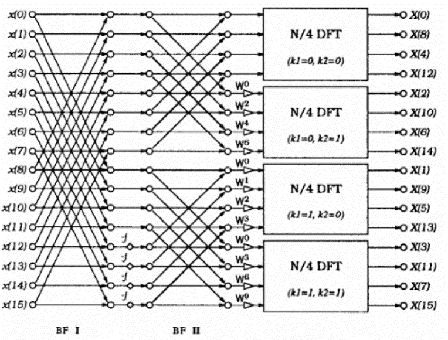
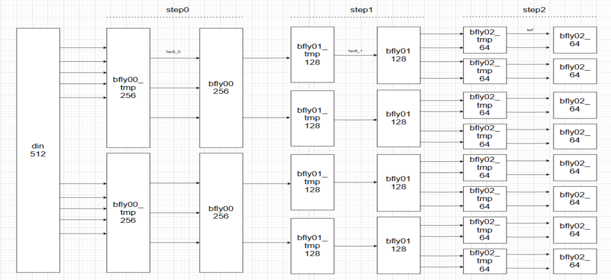
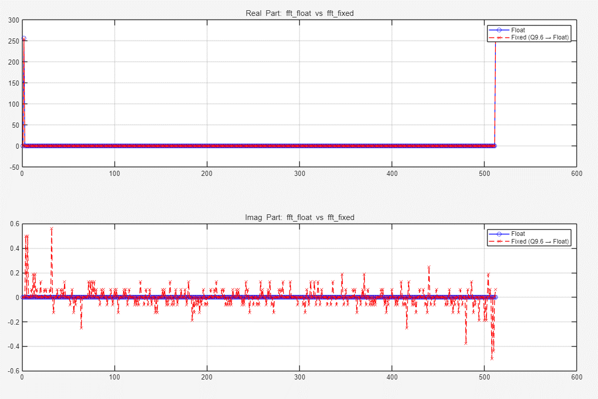

# 중간 정리   

## 과정
- **floating point**
  - fft
- **fixed point**
  - sqnr 성능 테스트
  - CBFP
- **파일 구조**
  - cos_in_gen.m / fft_fixed_stu.m / test_fft_fixed.m
  - ran_in_gen_stu.m / test_512p_sqnr_cal_stu.m
  - dec_to_bin.m / mag_detect.m / min_detect.m / sat.m

## FFT
<br>   
- Radix-4    

<br>
---------------------
### cos_in_gen.m
```MATLAB
% Added on 2024/01/12 by jihan 
function [data_float, data_fixed] = cos_in_gen(fft_mode, num)
 N = num;

 for i=1:N
	data_float_re(i) = cos(2.0*pi*(i-1)/N);
	data_float_im(i) = 0.0;
	data_float(i) = data_float_re(i) + j*data_float_im(i);
 end

 for i=1:N
  if (data_float_re(i)==1.0)
   if (fft_mode==1) % FFT
	%data_fixed_re(i) = 127; % <2.7>
	data_fixed_re(i) = 63; % <3.6> % Modified on 2025/07/02 by jihan
   else % IFFT
	data_fixed_re(i) = 255; % <1.8>
	%data_fixed_re(i) = 127; % <2.7> % Modified on 2025/07/02 by jihan
   end
  else	
   if (fft_mode==1) % FFT
	%data_fixed_re(i) = round(data_float_re(i)*128); % <2.7>
	data_fixed_re(i) = round(data_float_re(i)*64); % <3.6> % Modified on 2025/07/02 by jihan
   else % IFFT
	data_fixed_re(i) = round(data_float_re(i)*256); % <1.8>
	%data_fixed_re(i) = round(data_float_re(i)*128); % <2.7> % Modified on 2025/07/02 by jihan
   end
  end

  if (data_float_im(i)==1.0)
   if (fft_mode==1) % FFT
	%data_fixed_im(i) = 127; % <2.7>
	data_fixed_im(i) = 63; % <3.6> % Modified on 2025/07/02 by jihan
   else % IFFT
	data_fixed_im(i) = 255; % <1.8>
	%data_fixed_im(i) = 127; % <2.7> % Modified on 2025/07/02 by jihan
   end
  else	
   if (fft_mode==1) % FFT
	%data_fixed_im(i) = round(data_float_im(i)*128); % <2.7>
	data_fixed_im(i) = round(data_float_im(i)*64); % <3.6> % Modified on 2025/07/02 by jihan
   else % IFFT
	data_fixed_im(i) = round(data_float_im(i)*256); % <1.8>
	%data_fixed_im(i) = 127; % <2.7> % Modified on 2025/07/02 by jihan
   end
  end

	data_fixed(i) = data_fixed_re(i) + j*data_fixed_im(i);
 end
end
```
-----------------------
### fft_fixed_stu.m
```MATLAB
% Added on 2024/07/02 by jihan 
function [fft_out, module2_out] = fft_fixed_stu(fft_mode, fft_in)

 shift = 0;

	din = fft_in; % <2.7> => <3.6>

 fac8_0 = [1, 1, 1, -j];
 %fac8_1 = [1, 1, 1, -j, 1, 0.7071-0.7071j, 1, -0.7071-0.7071j]; % floating
 fac8_1 = [256, 256, 256, -j*256, 256, 181-j*181, 256, -181-j*181]; % fixed <1.8> -><2.8>

 %-----------------------------------------------------------------------------
 % Module 0
 %-----------------------------------------------------------------------------
 % step0_0
 % m1: din - 9bit; bfly00 - 10bit
 bfly00_out0 = din(1:256) + din(257:512);
 bfly00_out1 = din(1:256) - din(257:512);

 bfly00_tmp = [bfly00_out0, bfly00_out1];

 for nn=1:512
	bfly00(nn) = bfly00_tmp(nn)*fac8_0(ceil(nn/128));
 end

 % step0_1
 % m1: bfly00 - 10bit; bfly01_tmp - 11bit; bfly01 - 13bit
 for kk=1:2
  for nn=1:128
	bfly01_tmp((kk-1)*256+nn) = bfly00((kk-1)*256+nn) + bfly00((kk-1)*256+128+nn);
	bfly01_tmp((kk-1)*256+128+nn) = bfly00((kk-1)*256+nn) - bfly00((kk-1)*256+128+nn);
  end
 end


 fp_1=fopen('bfly01.txt','w');
 for nn=1:512
	temp_bfly01(nn) = bfly01_tmp(nn)*fac8_1(ceil(nn/64));
	bfly01(nn) = round(temp_bfly01(nn)/256);
	fprintf(fp_1, 'bfly01_tmp(%d)=%d+j%d, temp_bfly01(%d)=%d+j%d, bfly01(%d)=%d+j%d\n',nn, real(bfly01_tmp(nn)), imag(bfly01_tmp(nn)),nn,real(temp_bfly01(nn)),imag(temp_bfly01(nn)),nn,real(bfly01(nn)),imag(bfly01(nn)));
 end
 fclose(fp_1);

 % step0_2
 % m1: bfly01 - 12bit; bfly02_tmp - 13bit; pre_bfly02 - 14bit; bfly02 - 11bit
 for kk=1:4
  for nn=1:64
	bfly02_tmp((kk-1)*128+nn) = bfly01((kk-1)*128+nn) + bfly01((kk-1)*128+64+nn);
	bfly02_tmp((kk-1)*128+64+nn) = bfly01((kk-1)*128+nn) - bfly01((kk-1)*128+64+nn);
  end
 end

 for ii=1:512
 	%bfly02_tmp = sat(bfly02_tmp, 13); % Saturatin (13 bit)
 	bfly02_tmp(ii) = sat(bfly02_tmp(ii), 13); % Saturatin (13 bit)
 end

 % Data rearrangement
 K3 = [0, 4, 2, 6, 1, 5, 3, 7];

 for kk=1:8
  for nn=1:64
	flo_twf_m0((kk-1)*64+nn) = exp(-j*2*pi*(nn-1)*(K3(kk))/512);
	twf_m0((kk-1)*64+nn) = round(flo_twf_m0((kk-1)*64+nn)*128); % twf_m0 : <2.7>
  end
 end

 for nn=1:512
	%bfly02(nn) = bfly02_tmp(nn)*twf_m0(nn); % Org 
	pre_bfly02(nn) = bfly02_tmp(nn)*twf_m0(nn); % (14bit(13+1) * 9bit = 23 bit) 
 end

 % CBFP(Convergent Block Floating Point) stage0
 cnt1_re = zeros(1,8);
 cnt1_im = zeros(1,8);
 for ii=1:8
  for jj=1:64
	tmp1_re=mag_detect(real(pre_bfly02(64*(ii-1)+jj)),23);
	tmp1_im=mag_detect(imag(pre_bfly02(64*(ii-1)+jj)),23);
	temp1_re=min_detect(jj,tmp1_re,cnt1_re(ii));
	temp1_im=min_detect(jj,tmp1_im,cnt1_im(ii));
	cnt1_re(ii)=temp1_re;
	cnt1_im(ii)=temp1_im;
  end
 end %magnitude

 for ii=1:8
  if (cnt1_re(ii)<=cnt1_im(ii))
	cnt1_re(ii)=cnt1_re(ii);
  else
	cnt1_re(ii)=cnt1_im(ii);
  end
 end
		
 for ii=1:8
  if (cnt1_im(ii)<=cnt1_re(ii))
	cnt1_im(ii)=cnt1_im(ii);
  else
	cnt1_im(ii)=cnt1_re(ii);
  end
 end

 for ii=1:8
  for jj=1:64
	index1_re(64*(ii-1)+jj)=cnt1_re(ii);
	index1_im(64*(ii-1)+jj)=cnt1_im(ii);
  end
 end

 for ii=1:8
  for jj=1:64
   if (cnt1_re(ii)>12)
	re_bfly02(64*(ii-1)+jj)=bitshift(bitshift(real(pre_bfly02(64*(ii-1)+jj)),cnt1_re(ii), 'int32'),-12, 'int32');
   else
	re_bfly02(64*(ii-1)+jj)=bitshift(real(pre_bfly02(64*(ii-1)+jj)),(-12+cnt1_re(ii)), 'int32');
   end
  end
 end

 for ii=1:8
  for jj=1:64
   if (cnt1_im(ii)>12)
	im_bfly02(64*(ii-1)+jj)=bitshift(bitshift(imag(pre_bfly02(64*(ii-1)+jj)),cnt1_im(ii), 'int32'),-12, 'int32');
   else
	im_bfly02(64*(ii-1)+jj)=bitshift(imag(pre_bfly02(64*(ii-1)+jj)),(-12+cnt1_im(ii)), 'int32');
   end
  end
 end

 fp_2=fopen('cbfp_0.txt','w');
 for nn=1:512
	bfly02(nn) = re_bfly02(nn) + j*im_bfly02(nn);  
	fprintf(fp_2, 'twf_m0(%d)=%d+j%d, pre_bfly02(%d)=%d+j%d, index1_re(%d)=%d, index1_im(%d)=%d, bfly02(%d)=%d+j%d\n',nn, real(twf_m0(nn)), imag(twf_m0(nn)), nn, real(pre_bfly02(nn)), imag(pre_bfly02(nn)), nn, index1_re(nn), nn, index1_im(nn), nn, real(bfly02(nn)), imag(bfly02(nn)));
 end
 fclose(fp_2);
 
 %-----------------------------------------------------------------------------
 % Module 1
 %-----------------------------------------------------------------------------
 % step1_0
 % m1: bfly02 - 11bit; bfly10 - 12bit;

 for kk=1:8
  for nn=1:32
	bfly10_tmp((kk-1)*64+nn) = bfly02((kk-1)*64+nn) + bfly02((kk-1)*64+32+nn);
	bfly10_tmp((kk-1)*64+32+nn) = bfly02((kk-1)*64+nn) - bfly02((kk-1)*64+32+nn);
  end
 end

 for ii=1:512
 	bfly10_tmp(ii) = sat(bfly10_tmp(ii), 12); % Saturatin (12 bit)
 end

 for kk=1:8
  for nn=1:64
	bfly10((kk-1)*64+nn) = bfly10_tmp((kk-1)*64+nn)*fac8_0(ceil(nn/16));
  end
 end

 % step1_1
 % m1: bfly10 - 12bit; bfly11_tmp - 13bit; bfly11 - 14bit;
 for kk=1:16
  for nn=1:16
	bfly11_tmp((kk-1)*32+nn) = bfly10((kk-1)*32+nn) + bfly10((kk-1)*32+16+nn);
	bfly11_tmp((kk-1)*32+16+nn) = bfly10((kk-1)*32+nn) - bfly10((kk-1)*32+16+nn);
  end
 end

 for kk=1:8
  for nn=1:64
	temp_bfly11((kk-1)*64+nn) = bfly11_tmp((kk-1)*64+nn)*fac8_1(ceil(nn/8));
	bfly11((kk-1)*64+nn) = round(temp_bfly11((kk-1)*64+nn)/256);
  end
 end

 fp_3=fopen('bfly11.txt','w');
 for nn=1:512
	fprintf(fp_3, 'bfly11_tmp(%d)=%d+j%d, temp_bfly11(%d)=%d+j%d, bfly11(%d)=%d+j%d\n',nn, real(bfly11_tmp(nn)), imag(bfly11_tmp(nn)),nn, real(temp_bfly11(nn)), imag(temp_bfly11(nn)),nn, real(bfly11(nn)), imag(bfly11(nn)));
 end
 fclose(fp_3);


 % step1_2
 % m1: bfly11 - 14bit; bfly12_tmp - 15bit; pre_bfly12 - 16bit; bfly12 - 12bit;
 for kk=1:32
  for nn=1:8
	bfly12_tmp((kk-1)*16+nn) = bfly11((kk-1)*16+nn) + bfly11((kk-1)*16+8+nn);
	bfly12_tmp((kk-1)*16+8+nn) = bfly11((kk-1)*16+nn) - bfly11((kk-1)*16+8+nn);
  end
 end

 % Data rearrangement
 K2 = [0, 4, 2, 6, 1, 5, 3, 7];

 for kk=1:8
  for nn=1:8
	flo_twf_m1((kk-1)*8+nn) = exp(-j*2*pi*(nn-1)*(K2(kk))/64);
	twf_m1((kk-1)*8+nn) = round(flo_twf_m1((kk-1)*8+nn)*128); % twf_m0 : <2.7>
  end
 end

 for kk=1:8
  for nn=1:64
	pre_bfly12((kk-1)*64+nn) = bfly12_tmp((kk-1)*64+nn)*twf_m1(nn); % (16bit(15+1) * 9bit = 25 bit) 
  end
 end

 % CBFP(Convergent Block Floating Point) stage1
 cnt2_re = zeros(1,64);
 cnt2_im = zeros(1,64);
 for ii=1:64
  for jj=1:8
	tmp2_re=mag_detect(real(pre_bfly12(8*(ii-1)+jj)),25);
	tmp2_im=mag_detect(imag(pre_bfly12(8*(ii-1)+jj)),25);
	temp2_re=min_detect(jj,tmp2_re,cnt2_re(ii));
	temp2_im=min_detect(jj,tmp2_im,cnt2_im(ii));
	cnt2_re(ii)=temp2_re;
	cnt2_im(ii)=temp2_im;
  end
 end

 %{ 
 for ii=1:64
	X=sprintf('cnt2_re(%d)=%d\n', ii, cnt2_re(ii));
	disp(X);
 end
 %}

 for ii=1:64
  if (cnt2_re(ii)<=cnt2_im(ii))
	cnt2_re(ii)=cnt2_re(ii);
  else
	cnt2_re(ii)=cnt2_im(ii);
  end
 end
		
 for ii=1:64
  if (cnt2_im(ii)<=cnt2_re(ii))
	cnt2_im(ii)=cnt2_im(ii);
  else
	cnt2_im(ii)=cnt2_re(ii);
  end
 end

 for ii=1:64
  for jj=1:8
	index2_re(8*(ii-1)+jj)=cnt2_re(ii);
	index2_im(8*(ii-1)+jj)=cnt2_im(ii);
  end
 end

 
 for ii=1:64
  for jj=1:8
   if (cnt2_re(ii)>13)
	re_bfly12(8*(ii-1)+jj)=bitshift(bitshift(real(pre_bfly12(8*(ii-1)+jj)),cnt2_re(ii), 'int32'),-13, 'int32');
   else
	re_bfly12(8*(ii-1)+jj)=bitshift(real(pre_bfly12(8*(ii-1)+jj)),(-13+cnt2_re(ii)), 'int32');
   end
  end
 end

 for ii=1:64
  for jj=1:8
   if (cnt2_im(ii)>13)
	im_bfly12(8*(ii-1)+jj)=bitshift(bitshift(imag(pre_bfly12(8*(ii-1)+jj)),cnt2_im(ii), 'int32'),-13, 'int32');
   else
	im_bfly12(8*(ii-1)+jj)=bitshift(imag(pre_bfly12(8*(ii-1)+jj)),(-13+cnt2_im(ii)), 'int32');
   end
  end
 end


 fp_4=fopen('cbfp_1.txt','w');
 for nn=1:512
	bfly12(nn) = re_bfly12(nn) + j*im_bfly12(nn);  
	%fprintf(fp_4, 'twf_m1(%d)=%d+j%d, pre_bfly12(%d)=%d+j%d, index2_re(%d)=%d, index2_im(%d)=%d, bfly12(%d)=%d+j%d\n',nn, real(twf_m1(nn)), imag(twf_m1(nn)), nn, real(pre_bfly12(nn)), imag(pre_bfly12(nn)), nn, index2_re(nn), nn, index2_im(nn), nn, real(bfly12(nn)), imag(bfly12(nn)));
	fprintf(fp_4, 'pre_bfly12(%d)=%d+j%d, index2_re(%d)=%d, index2_im(%d)=%d, bfly12(%d)=%d+j%d\n', nn, real(pre_bfly12(nn)), imag(pre_bfly12(nn)), nn, index2_re(nn), nn, index2_im(nn), nn, real(bfly12(nn)), imag(bfly12(nn)));
 end
 fclose(fp_4);


 %-----------------------------------------------------------------------------
 % Module 2
 %-----------------------------------------------------------------------------
 % step2_0
 % m1: bfly12 - 12bit; bfly20 - 13bit;
 for kk=1:64
  for nn=1:4
	bfly20_tmp((kk-1)*8+nn) = bfly12((kk-1)*8+nn) + bfly12((kk-1)*8+4+nn);
	bfly20_tmp((kk-1)*8+4+nn) = bfly12((kk-1)*8+nn) - bfly12((kk-1)*8+4+nn);
  end
 end

 for kk=1:64
  for nn=1:8
	bfly20((kk-1)*8+nn) = bfly20_tmp((kk-1)*8+nn)*fac8_0(ceil(nn/2));
  end
 end

 % step2_1
 % m1: bfly20 - 13bit; bfly21_tmp - 14bit; bfly21 - 15bit;
 for kk=1:128
  for nn=1:2
	bfly21_tmp((kk-1)*4+nn) = bfly20((kk-1)*4+nn) + bfly20((kk-1)*4+2+nn);
	bfly21_tmp((kk-1)*4+2+nn) = bfly20((kk-1)*4+nn) - bfly20((kk-1)*4+2+nn);
  end
 end

 for ii=1:512
 	bfly21_tmp(ii) = sat(bfly21_tmp(ii), 14); % Saturatin (14 bit)
 end

 for kk=1:64
  for nn=1:8
	temp_bfly21((kk-1)*8+nn) = bfly21_tmp((kk-1)*8+nn)*fac8_1(nn);
	bfly21((kk-1)*8+nn) = round(temp_bfly21((kk-1)*8+nn)/256);
  end
 end

 fp_5=fopen('bfly21.txt','w');
 for nn=1:512
	fprintf(fp_5, 'bfly21_tmp(%d)=%d+j%d, temp_bfly21(%d)=%d+j%d, bfly21(%d)=%d+j%d\n',nn, real(bfly21_tmp(nn)), imag(bfly21_tmp(nn)),nn, real(temp_bfly21(nn)), imag(temp_bfly21(nn)),nn, real(bfly21(nn)), imag(bfly21(nn)));
 end
 fclose(fp_5);

 % step2_2
 % m1: bfly21 - 15bit; bfly22_tmp - 16bit; bfly22 - 13bit;
 for kk=1:256
	bfly22_tmp((kk-1)*2+1) = bfly21((kk-1)*2+1) + bfly21((kk-1)*2+2);
	bfly22_tmp((kk-1)*2+2) = bfly21((kk-1)*2+1) - bfly21((kk-1)*2+2);
 end

 for ii=1:512
 	bfly22_tmp(ii) = sat(bfly22_tmp(ii), 16); % Saturatin (16 bit)
 end

 for kk=1:512
	indexsum_re(kk)=index1_re(kk)+index2_re(kk);
	indexsum_im(kk)=index1_im(kk)+index2_im(kk);
 end

 for ii=1:512
  if (indexsum_re(ii)>=23)
	re_bfly22(ii) = 0;
  else
	re_bfly22(ii) = bitshift(real(bfly22_tmp(ii)), (9-indexsum_re(ii)), 'int32'); % 16bit => 13bit <8.5> => <9.4> (FFT)
  end
 end

 for ii=1:512
  if (indexsum_im(ii)>=23)
	im_bfly22(ii) = 0;
  else
	im_bfly22(ii) = bitshift(imag(bfly22_tmp(ii)), (9-indexsum_im(ii)), 'int32'); % 16bit => 13bit <8.5> (FFT)
  end
 end

 for nn=1:512
	bfly22(nn) = re_bfly22(nn) + j*im_bfly22(nn);
 end

 %bfly22 = bfly22_tmp;

 %-----------------------------------------------------------------------------
 % Index 
 %-----------------------------------------------------------------------------
 fp=fopen('fxd_reorder_index.txt','w');
 for jj=1:512
	%kk = bitget(jj-1,9)*(2^0) + bitget(jj-1,8)*(2^1) + bitget(jj-1,7)*(2^2) + bitget(jj-1,6)*(2^3) + bitget(jj-1,5)*(2^4) + bitget(jj-1,4)*(2^5) + bitget(jj-1,3)*(2^6) + bitget(jj-1,2)*(2^7) + bitget(jj-1,1)*(2^8);
	kk = bitget(jj-1,9)*1 + bitget(jj-1,8)*2 + bitget(jj-1,7)*4 + bitget(jj-1,6)*8 + bitget(jj-1,5)*16 + bitget(jj-1,4)*32 + bitget(jj-1,3)*64 + bitget(jj-1,2)*128 + bitget(jj-1,1)*256;
	dout(kk+1) = bfly22(jj); % With reorder
	%fprintf(fp, 'jj=%d, kk=%d, dout(%d)=%d+j%d, indexsum=%d\n',jj, kk,(kk+1),real(dout(kk+1)),imag(dout(kk+1)),indexsum_re(kk+1));
 end
 fclose(fp);

	fft_out = dout;
	module2_out = bfly22;
end
```
-----------
### test_fft_fixed.m
```MATLAB
% Test fft_fixed_stu against fft_float using cosine input
% Updated on 2025/07/22 by ChatGPT

clear; clc;
N = 512;
fft_mode = 1;

% 입력 신호 생성
[cos_float, cos_fixed] = cos_in_gen(fft_mode, N);

% Floating-point FFT
[fft_out_float, ~] = fft_float(fft_mode, cos_float);

% Fixed-point FFT (Q9.6 정수 포맷)
[fft_out_fixed, module2_out] = fft_fixed_stu(fft_mode, cos_fixed);


% 정수 Q9.6 → 실수 Q9.0 변환 (1/64 스케일 적용)
fft_out_fixed_float = double(fft_out_fixed) / 16;

% 실수부 비교 플롯
figure;
subplot(2,1,1);
plot(real(fft_out_float), 'b-o', 'DisplayName', 'Float');
hold on;
plot(real(fft_out_fixed_float), 'r--x', 'DisplayName', 'Fixed (Q9.6 → Float)');
title('Real Part: fft\_float vs fft\_fixed');
legend; grid on;

% 허수부 비교 플롯
subplot(2,1,2);
plot(imag(fft_out_float), 'b-o', 'DisplayName', 'Float');
hold on;
plot(imag(fft_out_fixed_float), 'r--x', 'DisplayName', 'Fixed (Q9.6 → Float)');
title('Imag Part: fft\_float vs fft\_fixed');
legend; grid on;

% 진폭 스펙트럼 비교
figure;
stem(abs(fft_out_float), 'b', 'DisplayName', 'Float'); hold on;
stem(abs(fft_out_fixed_float), 'r', 'DisplayName', 'Fixed (Q9.6 → Float)');
title('Magnitude Spectrum: fft\_float vs fft\_fixed');
legend; grid on;

% 최대 진폭 출력
fprintf('Max Magnitude (Float) = %.2f\n', max(abs(fft_out_float)));
fprintf('Max Magnitude (Fixed, Q9.6 → Float) = %.2f\n', max(abs(fft_out_fixed_float)));
```
---------
### ran_in_gen_stu.m
```MATLAB
% Added on 2025/07/02 by jihan 
function [data_float, data_fixed] = ran_in_gen_stu(fft_mode, num)
 N = num;
 M1 = 259200;
 IA1 = 7141;
 IC1 = 54773; 
 RM1 = 1.0/259200;
 M2 = 134456;
 IA2 = 8121;
 IC2 = 28441; 
 RM2 = 1.0/134456;
 M3 = 243000;
 IA3 = 4561;
 IC3 = 51349; 

 for i=1:512
	data_float_re(i) = rand(1);
	data_float_im(i) = rand;
	data_float(i) = data_float_re(i) + j*data_float_im(i);
 end

 for i=1:N
  if (data_float_re(i)==1.0)
	%data_fixed_re(i) = 127; % <2.7>
	data_fixed_re(i) = 63; % <3.6> % Modified on 2025/07/02 by jihan
  else	
	%data_fixed_re(i) = round(data_float_re(i)*128); % <2.7>
	data_fixed_re(i) = round(data_float_re(i)*64); % <3.6> % Modified on 2025/07/02 by jihan
  end

  if (data_float_im(i)==1.0)
	%data_fixed_im(i) = 127; % <2.7>
	data_fixed_im(i) = 63; % <3.6> % Modified on 2025/07/02 by jihan
  else	
	%data_fixed_im(i) = round(data_float_im(i)*128); % <2.7>
	data_fixed_im(i) = round(data_float_im(i)*64); % <3.6> % Modified on 2025/07/02 by jihan
  end

	data_fixed(i) = data_fixed_re(i) + j*data_fixed_im(i);
 end

end
```
---------------------
### test_512p_sqnr_cal_stu.m
```MATLAB
% Test fft function (fft_matlab vs. fft_manual) 
% Added on 2025/07/02 by jihan 
 N = 512;
 fft_mode = 1;
 [ran_float, ran_fixed] = ran_in_gen_stu(fft_mode, N);
 [cos_float, cos_fixed] = cos_in_gen(fft_mode, N);

 mat_float_fft = fft(ran_float); % Matlab fft (Random, Floating-point)
 %mat_float_fft = fft(cos_float); % Matlab fft (Cosine, Floating-point)

 [fft_out_fixed, module2_out_fixed] = fft_fixed_stu(1, ran_fixed); % Fixed-point fft (Random, fft)
 %[fft_out_fixed, module2_out_fixed] = fft_fixed_stu(1, cos_fixed); % Fixed-point fft (Cosine, fft)
 fft_out_fixed = fft_out_fixed/16; % Modified on 2025/07/02 by jihan

  fp_1=fopen('sqnr_fft.txt','w');
  for ii=1:N
	sig_pow(ii) = power(real(mat_float_fft(ii)),2) + power(imag(mat_float_fft(ii)),2);
	noise_re(ii) = real(mat_float_fft(ii)) - real(fft_out_fixed(ii));
	noise_im(ii) = imag(mat_float_fft(ii)) - imag(fft_out_fixed(ii));
	noise_pow(ii) = power(noise_re(ii),2) + power(noise_im(ii),2);
	fprintf(fp_1,'sig_pow(ii)=%f, noise_pow(ii)=%f\n', sig_pow(ii), noise_pow(ii)); 
  end
  fclose(fp_1);

  tot_sig_pow = 0.0;
  tot_noise_pow = 0.0;
  for ii=1:N
	tot_sig_pow = tot_sig_pow + sig_pow(ii);
	tot_noise_pow = tot_noise_pow + noise_pow(ii);
  end

  snr_val = 10*log10(tot_sig_pow/tot_noise_pow);

 X=sprintf('tot_sig_pow=%f, tot_noise_pow=%f, snr_val=%f\n',tot_sig_pow, tot_noise_pow, snr_val);
 disp(X);
```
---------------
### dec_to_bin.m
```MATLAB
% Added on 2024/01/29 by jihan 
function [out_dat] = dec_to_bin(in_dat, num) 

  if (in_dat>=0) 
   for i=1:num
	out_dat(i)=mod(in_dat,2);
	in_dat=floor(in_dat/2);
   end
  else
	in_dat=(-in_dat)-1;
   for i=1:num
	out_dat(i)=mod(in_dat,2);
	out_dat(i)=xor(out_dat(i),1);
	in_dat=floor(in_dat/2);
   end
  end

end
```
-------------------
### mag_detect.m
```MATLAB
% Added on 2024/01/29 by jihan 
function [cnt] = mag_detect(in_dat, num) 

  n=0;

  out_dat=dec_to_bin(in_dat, num);

  if (out_dat(num)==0) 
   for i=1:num-1
    if (out_dat(num-i)==0) 
	n=n+1;
    else
	break
    end	
   end
  else
   for i=1:num-1
    if (out_dat(num-i)==1) 
	n=n+1;
    else
	break
    end
   end
  end

  cnt=n;

end
```
--------------------
### min_detect.m
```MATLAB
% Added on 2024/01/29 by jihan 
function [min_val] = min_detect(index, cnt, temp) 

  if (index==1)
	min_val=cnt;
  else
    if (temp>cnt) 
	min_val=cnt;
    else
	min_val=temp;	
    end
  end

end
```
-------------
### sat.m
```MATLAB
% Added on 2024/01/29 by jihan 
function [out_dat] = sat(in_dat, num) % 11 <= num <= 16

  if (num==11) 
   if (in_dat>=1024)
	out_dat = 1023;
   elseif(in_dat<=-1024)	
	out_dat = -1024;
   else	
	out_dat = in_dat;
   end
  elseif (num==12)	
   if (in_dat>=2048)
	out_dat = 2047;
   elseif(in_dat<=-2048)	
	out_dat = -2048;
   else	
	out_dat = in_dat;
   end
  elseif (num==13)	
   if (in_dat>=4096)
	out_dat = 4095;
   elseif(in_dat<=-4096)	
	out_dat = -4096;
   else	
	out_dat = in_dat;
   end
  elseif (num==14)	
   if (in_dat>=8192)
	out_dat = 8191;
   elseif(in_dat<=-8192)	
	out_dat = -8192;
   else	
	out_dat = in_dat;
   end
  elseif (num==15)	
   if (in_dat>=16384)
	out_dat = 16383;
   elseif(in_dat<=-16384)	
	out_dat = -16384;
   else	
	out_dat = in_dat;
   end
  elseif (num==16)	
   if (in_dat>=32768)
	out_dat = 32767;
   elseif(in_dat<=-32768)	
	out_dat = -32768;
   else	
	out_dat = in_dat;
   end
  end
end
```
------------------
###  test
<br>
- fft_float vs fft_fixed
- 512 point, output/16
--------------
## CBFP (Convergent Block Floating Point)

### SNR 최적화의 필요성
- FFT 연산 과정에서는 트렁케이션(truncation) 및 다양한 연산으로 인해 **양자화 잡음**이 발생
- 이 잡음은 **출력 SNR(Signal-to-Noise Ratio)**을 저하시킴
- 고정소수점(Fixed-Point) 연산에서는 **비트 수 제한**으로 인해 소수점 이하 절삭이 빈번하며, 이는 **신호 품질 손상**으로 이어짐
- 목표: **출력 SNR을 최대화**하는 구조로 FFT 설계 필요

### Stage-by-Stage Scaling 전략
- 각 FFT stage별로 **다르게 scaling**을 적용하여 오버플로우를 방지하고 잡음 최소화
- 초기 stage는 scaling을 **적게**, 후반 stage는 **많이** 적용
- 입력 비트폭 분석 → **필요 최소 scaling**을 선택
   목적: 오버플로우 없이 신호 왜곡 최소화

### Bitwidth Allocation
- 각 연산의 결과에 대해 **정수부 + 소수부 비트 수(bit allocation)**를 조절
- 시뮬레이션 기반 최적 bitwidth 조합 도출
- 목표: **정밀도 향상**과 **비트 낭비 최소화**

### 시뮬레이션 결과 및 효과
- 논문 기준 **우수한 SNR 성능** 확인
- stage별 **noise budget**을 고려한 scaling 전략이 **SQNR(신호 대 양자화 잡음비)** 향상 및 **리소스 절감**에 효과적

### BFP와 CBFP 개요
- **BFP (Block Floating Point)**: 동일 블록의 데이터에 **공통 지수(exponent)** 사용, 각 요소는 **mantissa (유효 숫자)**로 표현
  - `block = exponent + mantissa[]`
- **CBFP (Convergent BFP)**:
  - MSB 탐색 후 **최소 비트만 시프트**, 데이터 손실 최소화
  - 시프트 후 비트폭 초과 시 **saturation 처리**
  - 고정소수점 대비 **정확도 유지 + 연산 효율 향상**

